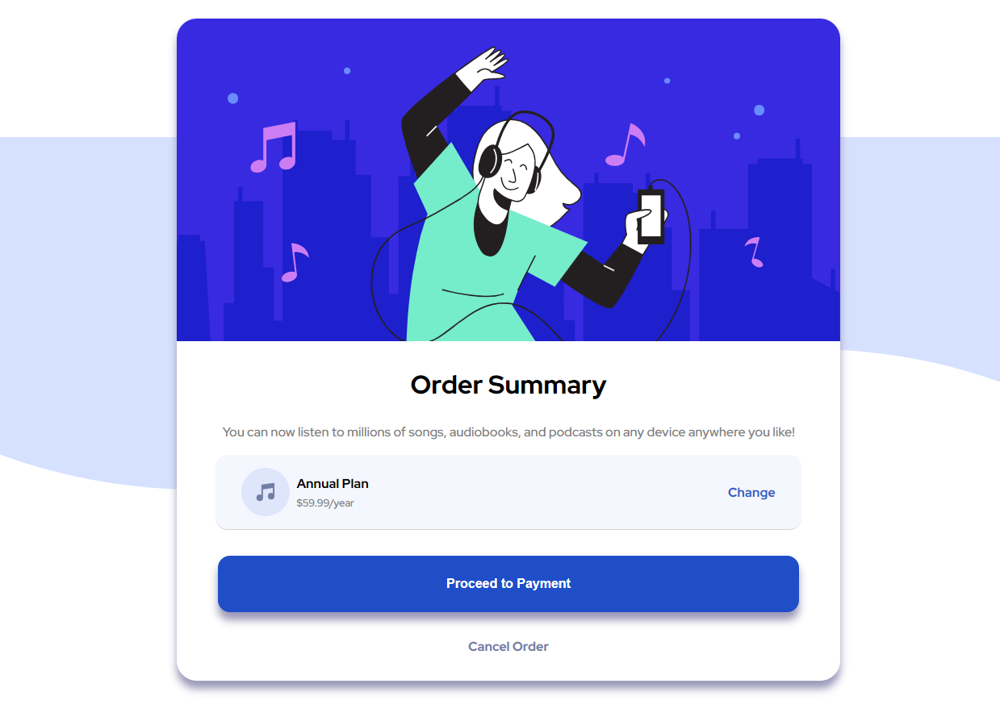

# Frontend Mentor - Order summary card solution

This is a solution to the [Order summary card challenge on Frontend Mentor](https://www.frontendmentor.io/challenges/order-summary-component-QlPmajDUj).

## Table of contents

- [Frontend Mentor - Order summary card solution](#frontend-mentor---order-summary-card-solution)
  - [Table of contents](#table-of-contents)
    - [Screenshot](#screenshot)
    - [Links](#links)
    - [Built with](#built-with)
    - [What I learned](#what-i-learned)
  - [Author](#author)

### Screenshot

### Links

- Solution URL: [[Add solution URL here](https://github.com/CyrusM3/order-summary-component-main/tree/main#the-challenge)]
- Live Site URL: [[Add live site URL here](https://order-summary-flexbox.netlify.app/)]

### Built with

- Semantic HTML5 markup
- CSS custom properties
- Flexbox
- Mobile-first workflow

### What I learned

I this project I learned about flexbox and how to use it to make a responsive website. I also learned how to use the box-shadow property to make the card look like it is floating. I also learned how to use the transform property to make the card look like it is hovering when the user hovers over it.

## Author

- Website - [Add your name here](https://www.aliebrahimi.dev/)
- Frontend Mentor - [@CyrusM3](https://www.frontendmentor.io/profile/CyrusM3)
